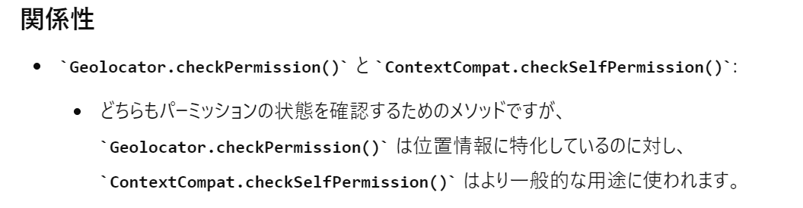
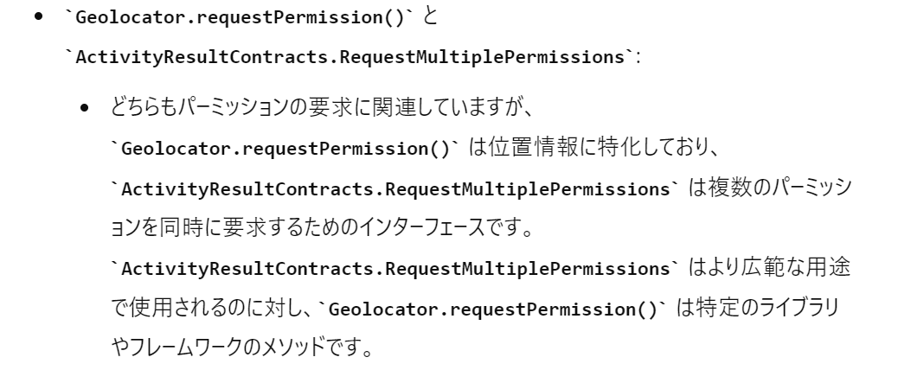

# 240824
## class Map()の作成
始めはFlutterのプラグインページを参考に進めたが、サンプルコードのエラーがでたので、別のページを参照した。
APIキーを取得してFlutterのManifestFileへの設定、Flutterのgoogle_mapプラグインのimportなどが必要
https://pub.dev/packages/google_maps_flutter

以下を参照して、2-3の現在地取得までのコードを利用した
https://qiita.com/my_programming/items/26b9ac6f0d2b3d1bd766#2-3%E5%9C%B0%E5%9B%B3%E3%81%A7%E7%8F%BE%E5%9C%A8%E5%9C%B0%E3%82%92%E5%8F%96%E5%BE%97%E3%81%99%E3%82%8B%E3%81%9F%E3%82%81%E3%81%AE%E3%82%B3%E3%83%BC%E3%83%87%E3%82%A3%E3%83%B3%E3%82%B0

デバッグするとエラーが出て、android/settings.grandleのKotlinのバージョンアップが必要だった。

デバッグ実行時のエラーはでなくなったが、地図が画面に表示されない

```error
======== Exception caught by gesture ===============================================================
The following LateError was thrown while handling a gesture:
LateInitializationError: Field 'mapController' has not been initialized.
```
おそらくAndroidStudioを再起動することでバグ解消され、実行できた

## 位置情報アクセスのパーミッション取得
パーミッション要求の方法は、位置情報に特化したもの（GeolocatorのIF）と、汎用的に使えるものがある。
今後も必要になるので、汎用的に使える方を実装する



https://zenn.dev/slowhand/articles/f4e4e092f9b72b
https://zenn.dev/attomicgm/articles/about_android_foreground_location_permission

# 240827
## APIキーをgit非公開にする方法を追加
以下を参照した。android/local.propertiesに環境変数を設定し、android/app/build.gradleでプライスホルダーに設定する。
https://www.entwicklernotizen.de/blog/how-to-handle-secret-api-keys-in-flutter-for-android-and-i-os/

さらに、上記では以下のエラーが発生した。
requires a placeholder substitution but no value for <applicationName> is provided.
→以下を参考に、manifestPlaceholders += [...]とした。
https://stackoverflow.com/questions/70906879/attribute-applicationname-at-androidmanifest-xml59-42-requires-a-placeholder

このままではgit公開されるので、android/.gitignoreに、/local_maps.propertiesを記載した
