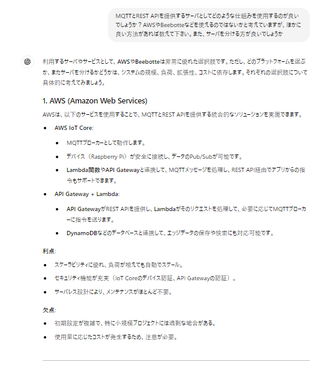
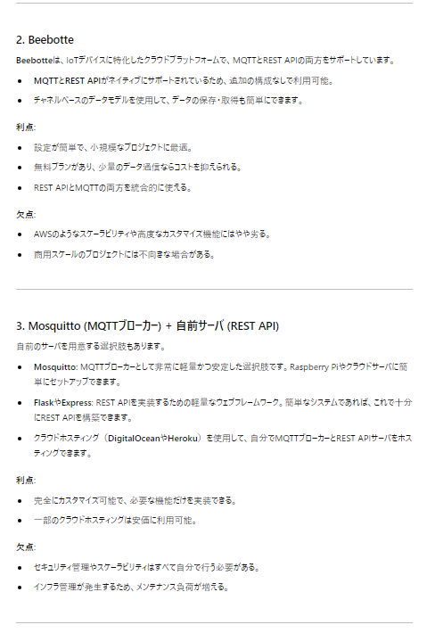
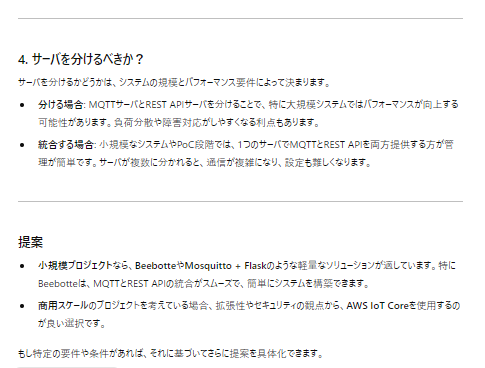

# 240824
## class Map()の作成
始めはFlutterのプラグインページを参考に進めたが、サンプルコードのエラーがでたので、別のページを参照した。
APIキーを取得してFlutterのManifestFileへの設定、Flutterのgoogle_mapプラグインのimportなどが必要
https://pub.dev/packages/google_maps_flutter

以下を参照して、2-3の現在地取得までのコードを利用した
https://qiita.com/my_programming/items/26b9ac6f0d2b3d1bd766#2-3%E5%9C%B0%E5%9B%B3%E3%81%A7%E7%8F%BE%E5%9C%A8%E5%9C%B0%E3%82%92%E5%8F%96%E5%BE%97%E3%81%99%E3%82%8B%E3%81%9F%E3%82%81%E3%81%AE%E3%82%B3%E3%83%BC%E3%83%87%E3%82%A3%E3%83%B3%E3%82%B0

デバッグするとエラーが出て、android/settings.grandleのKotlinのバージョンアップが必要だった。

デバッグ実行時のエラーはでなくなったが、地図が画面に表示されない

```error
======== Exception caught by gesture ===============================================================
The following LateError was thrown while handling a gesture:
LateInitializationError: Field 'mapController' has not been initialized.
```
おそらくAndroidStudioを再起動することでバグ解消され、実行できた

## 位置情報アクセスのパーミッション取得
パーミッション要求の方法は、位置情報に特化したもの（GeolocatorのIF）と、汎用的に使えるものがある。
今後も必要になるので、汎用的に使える方を実装する


https://zenn.dev/slowhand/articles/f4e4e092f9b72b
https://zenn.dev/attomicgm/articles/about_android_foreground_location_permission

# 240827
## APIキーをgit非公開にする方法を追加
以下を参照した。android/local.propertiesに環境変数を設定し、android/app/build.gradleでプレイスホルダーに設定する。
https://www.entwicklernotizen.de/blog/how-to-handle-secret-api-keys-in-flutter-for-android-and-i-os/
https://dev.to/no2s14/hide-your-api-keys-from-your-android-manifest-file-with-flutter-using-local-properties-3f4e

さらに、上記では以下のエラーが発生した。
requires a placeholder substitution but no value for <applicationName> is provided.
→以下を参考に、manifestPlaceholders += [...]とした。
https://stackoverflow.com/questions/70906879/attribute-applicationname-at-androidmanifest-xml59-42-requires-a-placeholder

このままではgit公開されるので、android/.gitignoreに、/local_maps.propertiesを記載した

# 240901
## 位置情報アクセスのパーミッション取得の実装
以下を参考に実装を進める。（Flutterのパーミッション要求の例はあまり見つからなかった）
問題：一度、don't allowを選択すると、ずっとパーミッション要求のポップアップが出てこず詰まってしまった。
→エミュレータの設定アプリからパーミッションを毎回要求するように設定変更が必要
https://medium.com/@dudhatkirtan/how-to-use-permission-handler-in-flutter-db964943237e

# 240915
## ラズパイとスマホアプリの通信方法の検討
### システム構成の結論
  * ラズパイーサーバ：MQTT
    * ブローカーとして無料サーバのbeebotteを使用する
    * beebotteはMQTTサーバ、REST APIの使用が可能、無料、AWSよりも簡単
  * サーバースマホアプリ：REST API
  
  
  

### beebotteの動作確認
コマンドプロンプトからcurlコマンドにより、RESTとPubSubの動作確認を行う
https://gist.github.com/yoggy/28196ba084f9c406c75967289fbb3dca
https://beebotte.com/docs/write

#### REST API
##### Read
```curl -H "Content-Type: application/json" -H "X-Auth-Token: token_xxxxxxxxxxxx" -X GET http://api.beebotte.com/v1/data/read/REST_API_TEST/beebotte_test```

##### Write
* windowsではシングルクオーテーションを使えない、Jsonの中でダブルクオーテーションを使うときは\"にするという注意が必要。ここで1時間くらい詰まった
https://qiita.com/tocoteron/items/291b463e45f422abd425#comments

```curl -H "Content-Type: application/json" -H "X-Auth-Token: token_xxxxxxxxxxxx" -X POST http://api.beebotte.com/v1/data/write/REST_API_TEST/beebotte_test -d "{\"data\":\"hello\"}"```


#### Pub/Sub
* subscribeはコマンド上ではできないので、publishだけテストする
```curl -H "Content-Type: application/json" -H "X-Auth-Token: token_xxxxxxxxxxxx" -X POST http://api.beebotte.com/v1/data/publish/REST_API_TEST/beebotte_test -d "{\"data\":\"hi\"}"```


次回は以下のチュートリアルに倣って、ラズパイからのpublishをテストする
https://beebotte.com/tutorials/monitor_humidity_and_temperature_with_raspberrypi

# 0929
## openAIのAPIを使ってChatアプリを作ってみる
openAIのAPIキーを発行する
https://platform.openai.com/settings/profile?tab=api-keys

REST APIによりJsonでやり取りができる

APIキーをGoogleMapの時と同じようにproperties, build.gradle, gitignore, manifestに記載する

manifest.xmlからメタデータを取得する方法
https://stackoverflow.com/questions/38687159/what-is-metadata-and-what-is-the-use-of-it-in-android
https://puyooboe.blogspot.com/2013/08/androidmanifestxml-meta-data.html
https://flutterawesome.com/flutter-get-android-meta-data-in-androidmanifest-xml/
→ Androidネイティブコード側の MainActivity.ktまで見ないと行けなさそう。。。
→上記のやり方ではなく、環境変数でAPIキーを登録する方法の方が簡単そう
https://medium.com/@akhil-ge0rge/hiding-secret-keys-in-your-flutter-app-fea9d60e9eb8
https://flutterawesome.com/flutter-get-android-meta-data-in-androidmanifest-xml/


